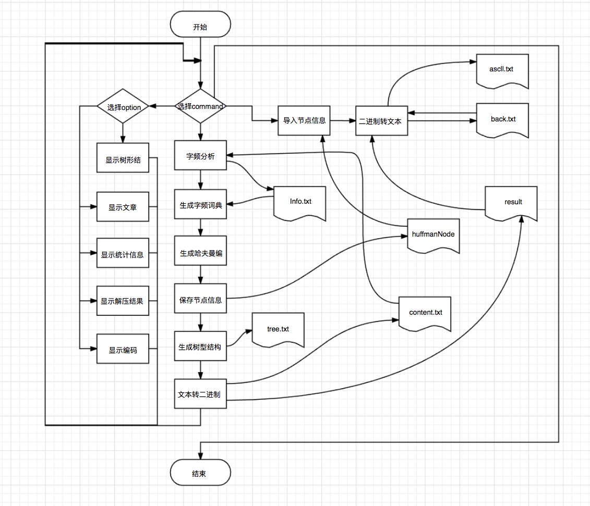

# huffmanCompress
## 简介
这是一个简单的Huffman压缩／解压程序，目前可以压缩较小的文本文件，还不具有实用功能，这原本是我的数据结构期末大作业，po到这里来继续完善。
## 运行环境
Xcode
## 注意事项
在下载到本地之后，要把文件中的所有文件名，改成当地的文件路径，才可以正常的使用。
## 程序概要

## 特点
这个程序可以用show tree命令，来显示被压缩文件的Huffman树的形状。
## 仍需解决的问题
- 解压的文件大小限制
- huffman相关信息的保存

